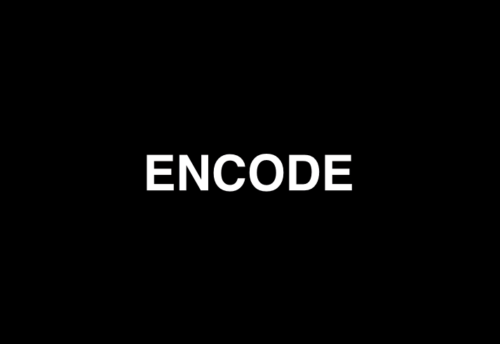
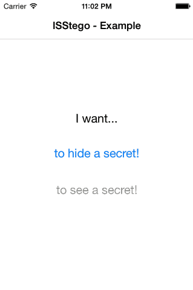

# ISStego

ISStego is an Objective-C library for Mac OS X & iOS that can be used to encode and decode secret data with images using digital techniques of steganography, a form of security through obscurity.

## What is Steganography?

Steganography comes from the Greek words *steganos*, meaning **covered or protected**, and *graphein*, meaning **writing**. Basically it is the practice of hiding important information within a unimportant object. For instance we can hide a message within another message, image, audio or video. 

See example:

| original Image | Stego image | 
| :---: | :---: | 
|  |  |
| Pure image (without hidden information) | Image with a steganographically hidden text (3360 characters). |

### [Steganography isEqualTo:Encryption]?

FALSE. They are completely different.

The main propose of encryption is to **hide the meaning** of the message by converting ordinary information (*plaintext*) into unintelligible text (*ciphertext*). You can detect if something has been encrypted. 

On the other hand, steganography **hides the information itself** and most people would not detect its presence.

### Should we use only steganography?

Steganography is a form of security but it is not unique. We can (and we recommend using) use other forms of security, such as encryption, in addition to steganography.

[See also](https://en.wikipedia.org/wiki/Steganography).

## How does ISStego work?

ISStego uses three steganography techniques:

- **Least Significant Bit (LSB)**: ISStego takes the binary representation of each pixel of image and overwrites the LSB of some bytes with the bits of information using CoreGraphics framework;
- **Sequential Colour Cycle (SCC)**: Each pixel has four bytes of information regarding the colors red, green and blue (RGB) and the channel alpha (transparency). With SCC, ISStego  embeds the bits of information, rotating the colour bytes.
- **Uniform Distribution**: The bits of information are distributed uniformly throughout the image.

## Installation

### Manual

Drag the [ISStego](ISStego/) folder into your project.

###CocoaPods

Or you can use [CocoaPods](http://cocoapods.org/?q=ISStego).

```ruby
pod 'ISStego'
```


## Examples
### OS X
[ISStego OS X Example](Examples/ISStego\ OS\ X\ Example)


### iOS
[ISStego iOS Example](Examples/ISStego\ iOS\ Example)



## Usage

Import ISSteganographer
```objective-c
#import "ISSteganographer.h"
```

### iOS

#### Encode

```objective-c
NSString *encryptedPassword = @"47151d0e56f8dc";

UIImage *image  = [UIImage imageNamed:@"imageName"];

[ISSteganographer hideData:encryptedPassword
                 withImage:image
           completionBlock:^(id image, NSError *error) {
               if (error) {
                   NSLog(@"error: %@", error);
               } else {
                   [UIImagePNGRepresentation(image) writeToFile:@"PATH_OF_FILE"
                                                     atomically:YES];
               }
           }];
```


#### Decode

```objective-c
UIImage *image  = [UIImage imageNamed:@"stegoImageName"];

[ISSteganographer dataFromImage:image
                completionBlock:^(NSData *data, NSError *error) {
                    if (error) {
                        NSLog(@"error: %@", error);
                    } else {
                        NSString *hiddenData = [[NSString alloc] initWithData:data
                                                                     encoding:NSUTF8StringEncoding];
                        NSLog(@"string: %@", hiddenData);
                    }
                }];
```
### Mac OS X

#### Encode

```objective-c
NSString *encryptedPassword = @"47151d0e56f8dc";

NSImage *image  = [NSImage imageNamed:@"imageName"];

[ISSteganographer hideData:encryptedPassword
                 withImage:image
           completionBlock:^(id image, NSError *error) {
               if (error) {
                   NSLog(@"error: %@", error);
               } else {
                   CGImageRef cgRef = [image CGImageForProposedRect:NULL
                                                            context:nil
                                                              hints:nil];
                   
                   NSBitmapImageRep *bitmapImage = [[NSBitmapImageRep alloc] initWithCGImage:cgRef];
                   
                   [bitmapImage setSize:[image size]];
                   
                   NSData *pngData = [bitmapImage representationUsingType:NSPNGFileType
                                                          properties:nil];
                   
                   [pngData writeToFile:@"PATH_OF_FILE"
                             atomically:YES];
                   
                   bitmapImage = nil;
               }
           }];
```

#### Decode

```objective-c
NSImage *image  = [NSImage imageNamed:@"stegoImageName"];

[ISSteganographer dataFromImage:image
                completionBlock:^(NSData *data, NSError *error) {
                    if (error) {
                        NSLog(@"error: %@", error);
                    } else {
                        NSString *hiddenData = [[NSString alloc] initWithData:data
                                                                     encoding:NSUTF8StringEncoding];
                        NSLog(@"string: %@", hiddenData);
                    }
                }];
```


## Author

Isaac Stevao Sena, [@IsaacStevaoSena](https://twitter.com/isaacstevaosena)

## License

ISStego is released under the MIT license. See
[LICENSE.md](https://github.com/isena/ISStego/blob/master/LICENSE.md).
